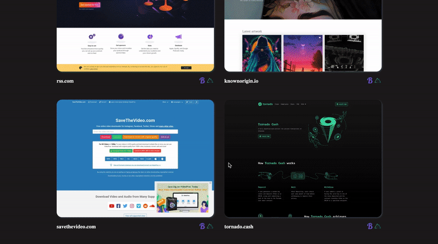

# Vue Telescope Expo

Fully customizable expo component for Vue.js that fetches data from [VueTelescope](https://vuetelescope.com/)!
We're using this component inside [Oruga's documentation](https://oruga.io/expo/).

<p align="center">
    <a href="https://www.npmjs.com/package/vue-telescope-expo"></a>
    <a href="https://www.npmjs.com/package/vue-telescope-expo"></a>
    <a href="https://github.com/oruga-ui/vue-telescope-expo/actions"><a>
    <a href="https://codecov.io/gh/oruga-ui/vue-telescope-expo"></a>
</p>

<p align="center">
    
</p>

## Installation

```sh
yarn add vue-telescope-expo
```

## Usage

```js
import VueTelescopeExpo from 'vue-telescope-expo'
import 'vue-telescope-expo/dist/vue-telescope-expo.css'

export default {
  components: { VueTelescopeExpo },
}
```

```html
<template>
  <div id="app">
    <vue-telescope-expo :slugs="{ui: 'oruga'}" :image-width="800"/>
  </div>
</template>
```

### Properties

| Name          | Type   | Default value             | Description                                                                 |
| ------------- | ------ | ------------------------- | --------------------------------------------------------------------------- |
| slugs         | Object | `null`                    | `{framework: 'nuxtjs', ui: 'buefy', plugins: ['vue-i18n', 'vue-apollo']}`   |
| imageWidth    | Number | `800`                     | Preview image width in pixels                                               |
| sortBy        | String | `"rank"`                  | Sort criteria (`"rank"`, `"lastDetectedAt"`)                                |
| sortDirection | String | `"asc"`                   | Sort direction (`"asc"`, `"desc"`)                                          |
| labelRetry    | String | `"Retry"`                 | Label shown on button during retry                                          |
| labelError    | String | `"Something went wrong!"` | Label shown when something goes wrong                                       |
| labelLoadMore | String | `"Load more"`             | Label shown on button to load more                                          |
| labelLoading  | String | `"Loading..."`            | Label shown during loading                                                  |

### Slots

🔷 `buttons`

Use this slot to override buttons. This slot receives:
- `loading`: variable that indicates whether the component is loading items.
- `loadMoreItems`: method used to load more items.
- `hasMoreItems`: method used to check if there are more items to load.
- `labelLoadMore`: labelLoadMore property.
- `labelLoading`: labelLoading property.

🔷 `retry` 

Use this slot to override part. This slot receives: 
- `firstLoadItems`: method that fires the first items loading process.

🔷 `item`

Use this slot to override the items' template. This slot receives:
- `item`: object representing a VueTelescope item.

Here's a simple customization using Oruga UI components

```html
<vue-telescope-expo :slugs="{ ui: 'oruga' }">
    <template v-slot:buttons="{ loading, hasMoreItems, loadMoreItems }">
        <o-button v-if="hasMoreItems" root-class="loadingbtn" elements-wrapper-class="loadingbtnwrapper" @click="loadMoreItems">
            <o-icon root-class="loadingicon" v-if="loading" pack="fas" icon="sync-alt" spin> </o-icon>
            <span v-else>Load more</span>
        </o-button>
    </template>
    <template v-slot:retry="{ firstLoadItems }">
        <p>Something went wrong!</p>
        <o-button @click="firstLoadItems">Retry</o-button>
    </template>
</vue-telescope-expo>
```

## Project setup

```sh
yarn install
```

### Compiles and minifies for production

```sh
yarn build
```

### Run your component tests

```sh
yarn test
```

### Lints and fixes files

```sh
yarn lint
```
